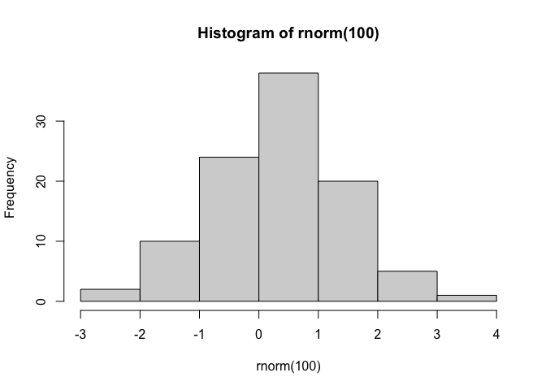

# meublog

md significa markdown

- item1
- item2

## Titulo 

### Subtitulo

### subsubtitulo

> isso é uma citacao

CTRL+ALT+I


```r
library(ggplot2)
```

```
## Warning: package 'ggplot2' was built under R version 4.1.2
```

```r
head(iris)
```

```
##   Sepal.Length Sepal.Width Petal.Length Petal.Width Species
## 1          5.1         3.5          1.4         0.2  setosa
## 2          4.9         3.0          1.4         0.2  setosa
## 3          4.7         3.2          1.3         0.2  setosa
## 4          4.6         3.1          1.5         0.2  setosa
## 5          5.0         3.6          1.4         0.2  setosa
## 6          5.4         3.9          1.7         0.4  setosa
```


```r
hist(rnorm(100))
```

<!-- -->

